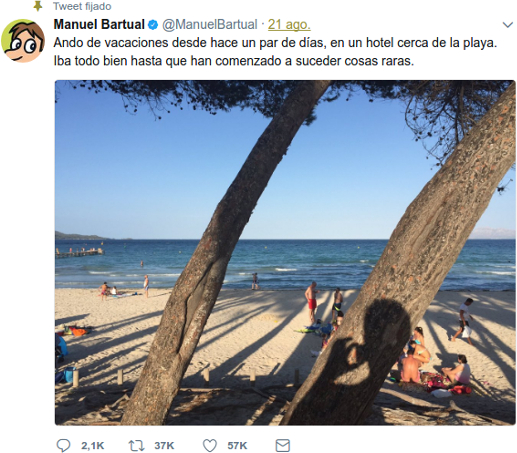

# manuel-bartual

Do you know the best Twitter's thread ever?

This small tool gets the reactions about the [Manuel Bartual's thread](https://twitter.com/ManuelBartual/status/899719483752935426).

### What is shown?

The output is in CSV format but without headers.
< positive ratio >,< negative ratio >,< language >, < location >

## How to run
You need the Twitter API keys ([get your Twitter API keys from this link](https://apps.twitter.com/)). Then, set the following environment variables:
* ACCESS_TOKEN
* ACCES_TOKEN_SECRET
* CONSUMER_KEY
* CONSUMER_SECRET

You can install the dependencies with ``pip install -r requirements.txt``.

Finally, ``python run.py``

**Tested with Python 3.5**

### The MIT License (MIT)
    Copyright (c) 2017 Israel Blancas @iblancasa (http://iblancasa.com/)

    Permission is hereby granted, free of charge, to any person obtaining a copy of this software
    and associated documentation files (the “Software”), to deal in the Software without
    restriction, including without limitation the rights to use, copy, modify, merge, publish,
    distribute, sublicense, and/or sell copies of the Software, and to permit persons to whom
    the Software is furnished to do so, subject to the following conditions:

    The above copyright notice and this permission notice shall be included in all copies or
    substantial portions of the Software.

    THE SOFTWARE IS PROVIDED “AS IS”, WITHOUT WARRANTY OF ANY KIND, EXPRESS OR IMPLIED,
    INCLUDING BUT NOT LIMITED TO THE WARRANTIES OF MERCHANTABILITY, FITNESS FOR A PARTICULAR
    PURPOSE AND NONINFRINGEMENT. IN NO EVENT SHALL THE AUTHORS OR COPYRIGHT HOLDERS BE LIABLE
    FOR ANY CLAIM, DAMAGES OR OTHER LIABILITY, WHETHER IN AN ACTION OF CONTRACT, TORT OR OTHERWISE,
    ARISING FROM, OUT OF OR IN CONNECTION WITH THE SOFTWARE OR THE USE OR OTHER DEALINGS
    IN THE SOFTWARE.
